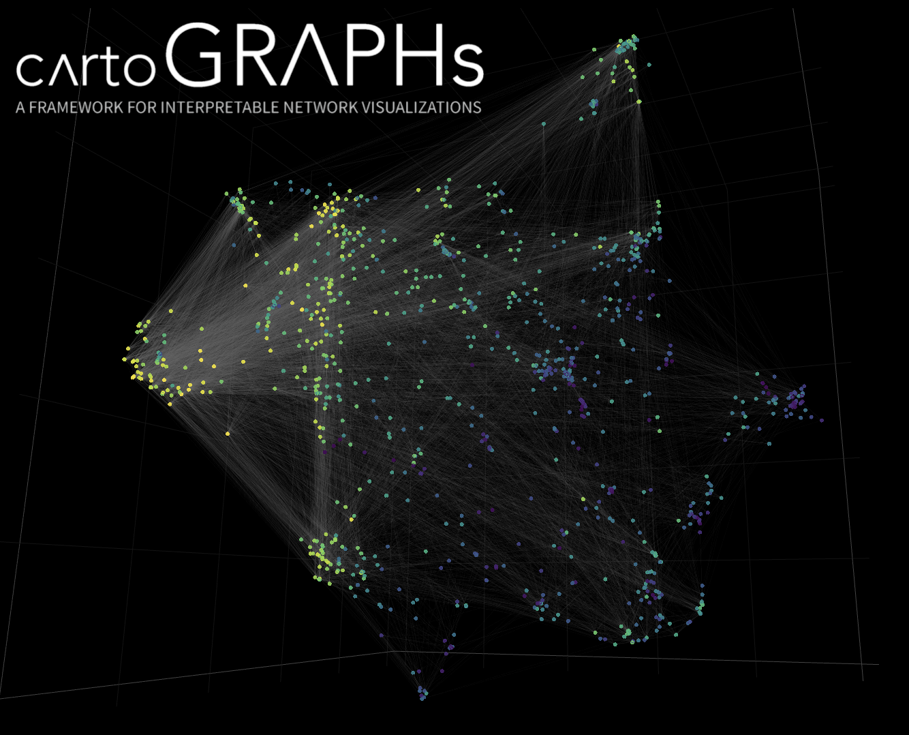

---

Networks offer an intuitive visual representation of complex systems. Important network
characteristics can often be recognized by eye and, in turn, patterns that stand out
visually often have a meaningful interpretation. However, conventional network layouts
are difficult to interpret, as they offer no direct connection between node position and
network structure. Here, we propose an approach for directly encoding arbitrary
structural or functional network characteristics into node positions. We introduce a
series of two and three-dimensional layouts, benchmark their efficiency for model
networks, and demonstrate their power for elucidating s tructure to function 
relationships in large-scale biological networks.

---

### **REPOSITORY STRUCTURE**
The structue of the project Github repo is as described below:
```
menchelab/cartoGRAPHs
- cartoGRAPHs_main.py ---> main functions used in the jupyter notebook
- cartoGRAPHs_main.ipynb ---> jupyter notebook to visualize networks (examples are human interactome and yeast interactome, as introduced in the manuscript)
├── input ---> all input data required to reproduce figures in jupyter notebook and python files
├── benchmark ---> benchmark evaluations 
├── output_plots ---> folder for saving produced plots during notebook sessions 
└── .gitignore
```

---

### **HOW TO USE THE FRAMEWORK**

The code can be run using Jupyter Notebook/Lab and will soon be available as a python package. 
The main script for producing Layouts for the Protein-Protein Interaction Network (*homo sapiens* or *saccharomyces cerevisiae*) 
is entitled "cartographs_main.ipynb" with the python functions included in "cartographs_main.py". Input files essential to run the scripts can be downloaded
[here](https://drive.google.com/file/d/1_FR-It9-h9ZZ1Pn-ErwGqxxIlMCHG_54/view?usp=sharing) and shall be unpacked in the location of the jupyter notebook. 
A web-based application was developed to inspect networks through a user interface. The repository of the web application can be reached at [MENCHELAB/cartoGRAPHs](https://github.com/menchelab/cartoGRAPHs_app). 

---

### **NETWORK LAYOUTS**
Four different Layouts can be produced. 

+ local layout (based on node pairwise adjacencies)
+ global layout (based on network propagation)
+ importance layout (based on network centrality metrics, such as degree, closeness, betweenness and eigenvector centrality)
+ functional layout (e.g. based on a *NxM* matrix including *N* nodes in the network and *M* features)

---

### **NETWORK CATEGORIES**

Four different Layout Categories are implemented. 
+ 2D Network portrait
+ 3D Network portrait
+ 3D Topographic Network Map
+ 3D Geodesic Network Map

---

### **INTERDISCIPLINARY ENVIRONMENT**

A web-based application was developed to visually inspect networks with different layouts and maps in three dimensions. The repository of the web application can be reached [here](https://github.com/chris-huetter/cartoGRAPHs_app).

---

### **MODEL NETWORKS FOR BENCHMARKING**

To benchmark the framework, model networks with well-known architecture, such as Cayley Tree, Cubic Grid and Torus Lattice were used.
The code to run and reproduce layouts with aforementioned model networks can be viewed in the folder "benchmark". The respective scripts are partitioned based on model network and precalculated files, for network distance comparison can be downloaded [here](https://drive.google.com/file/d/1_Fhc6pbW8TfCB9jYUQGG-8I5qLs1niUZ/view?usp=sharing). Please unzip and place the folder in the directory of the benchmarking scripts (i.e. in the "benchmark" folder). 

---

### **LIBRARIES / PACKAGE REQUIREMENTS**

The following packages incl. versions were used: 
```
python<=3.6

biopython==1.78
ipykernel==5.3.4
numpy==1.20.1
scipy==1.5.2
matplotlib==2.2.3
colormap==1.0.3
pandas==1.0.1
colormath==3.0.0
networkx==2.3
plotly==4.14.3
pymysql==1.0.2
seaborn==0.11.1
umap-learn==0.5.1
scikit-learn==0.24.1

```

---

### **SYSTEM REQUIREMENTS**
All Visualizations with networks up to 20,000 nodes and ~300,000 links in the main jupyter notebook were carried out on a machine with a 2 GHz Quad-Core Intel Core i5 and 16GB or Memory. 
Heavier computation, such as performed during layout benchmarking, was calculated on a cluster and stored in the benchmark/netdist_precalc folder. 

*Please note : This project is work in progress and will be updated/improved frequently.*

