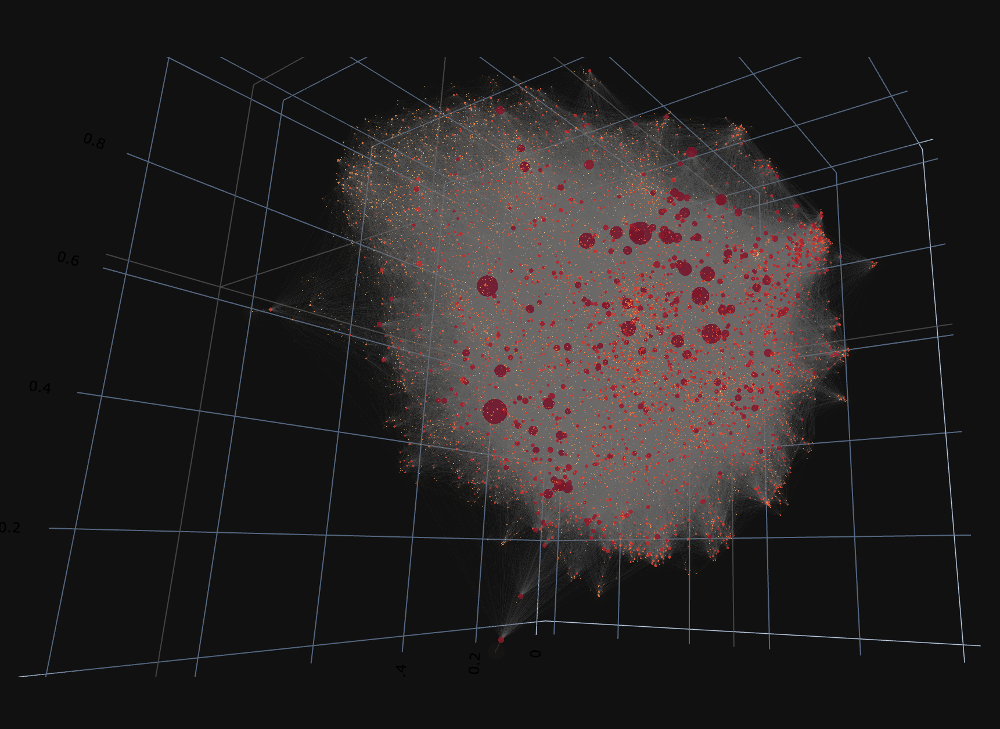

# CartoGRAPHs
### A Framework for Interpretable Network Visualizations

Networks offer an intuitive visual representation of complex systems. Important network
characteristics can often be recognized by eye and, in turn, patterns that stand out
visually often have a meaningful interpretation. However, conventional network layouts
are difficult to interpret, as they offer no direct connection between node position and
network structure. Here, we propose an approach for directly encoding arbitrary
structural or functional network characteristics into node positions. We introduce a
series of two and three-dimensional layouts, benchmark their efficiency for model
networks, and demonstrate their power for elucidating s tructure to function 
relationships in large-scale biological networks.

### **HOW TO USE THE FRAMEWORK**

*Please note : This project is work in progress and will be updated/improved frequently.*

At the moment the code can be run using Jupyter Notebook/Lab and will soon be available as a python package. 
The main script for producing Layouts for the Protein-Protein Interaction Network (*homo sapiens* or *saccharomyces cerevisiae*) 
is entitled "cartographs_main.ipynb" with the python functions included in "cartographs_main.py". Input files essential to run the scripts can be downloaded
<a href="https://drive.google.com/file/d/1_FR-It9-h9ZZ1Pn-ErwGqxxIlMCHG_54/view?usp=sharin" target="_blank">here</a>.

[here](https://drive.google.com/file/d/1_FR-It9-h9ZZ1Pn-ErwGqxxIlMCHG_54/view?usp=sharing) and shall be unpacked in the location of the jupyter notebook. 

A web-based application will be available to the public soon. 

Evaluation of the layouts can be done using model networks (e.g. Caley tree, cubic grid and torus lattice). The code to run and reproduce layouts with aforementioned model networks can be viewed in the folder "benchmark". The respective scripts are partitioned based on model network and precalculated files, for network distance comparison can be downloaded [here](https://drive.google.com/file/d/1_Fhc6pbW8TfCB9jYUQGG-8I5qLs1niUZ/view?usp=sharing). Please unzip and place the folder in the directory of the benchmarking scripts (i.e. in the "benchmark" folder). 

### **NETWORK LAYOUT CATEGORIES**

Four different Layout Categories are implemented. 
+ 2D Network portrait
+ 3D Network portrait
+ 3D Topographic Network Map
+ 3D Geodesic Network Map

### **MODEL NETWORKS FOR BENCHMARKING**

To benchmark the framework, model networks with well-known architecture, such as Cayley Tree, Cubic Grid and Torus Lattice were used. The scripts regarding all benchmarking figures can be found in the folder "benchmarks". The network distances for all model network sizes, which are required to run the scripts were precalculated and can be downloaded from here and shall be located in the folder "benchmark" after unzipping.  
