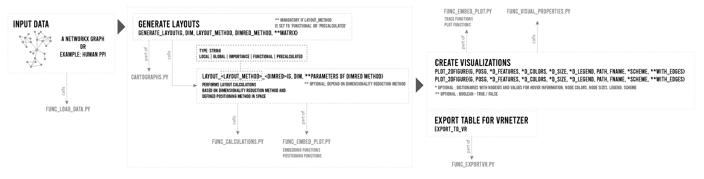

# cartoGRAPHs 
### Visual Network Exploration in two and three dimensions.


---

Networks offer an intuitive visual representation of complex systems. Important network
characteristics can often be recognized by eye and, in turn, patterns that stand out
visually often have a meaningful interpretation. However, conventional network layouts
are difficult to interpret, as they offer no direct connection between node position and
network structure. Here, we propose an approach for directly encoding arbitrary
structural or functional network characteristics into node positions. We introduce a
series of two and three-dimensional layouts, benchmark their efficiency for model
networks, and demonstrate their power for elucidating structure to function 
relationships in large-scale biological networks.


---

## **ABOUT CARTOGRAPHS**

CartoGRAPHs is a python package to generate two- and three-dimensional layouts of networks using python. 
Here you will find jupyter notebooks to use our method of visualizing different network characteristics using
feature modulation and dimensionality reduction techniques.

To get a first glance on the framework, we provide a Quickstarter Notebook with an examplary graph. Additionally 
one can dive deeper into real world networks, with our other Notebooks focusing on the Protein Protein Interaction Network.

---

## **INSTALLATION**

A package version can be installed via
```
pip install cartoGRAPHs
```
More information here: https://pypi.org/project/cartoGRAPHs/0.0.3/

---

## **INPUT DATA**

To use the Jupyter Notebooks provided for the Human PPI, please download the input files from [Zenodo](insert zenodo link).
The files are located in the "input" folder and should be unzipped at the location of the Notebook used. 
The folder includes a PPI edgelist, Disease Ontology files, Gene Ontology files and Gene lists, 
such as Essentiality, Rare Diseases, Early Developmental Genes. 
Additionally one can find preprocessed Feature Matrices for diverse layouts, due to exceeding calculation time for large networks. 

---

## **REPOSITORY STRUCTURE**

#### NOTEBOOKS TO USE THE FRAMEWORK 

+ **Quickstarter** : cartoGRAPHs_AQuickStarter.ipynb 
The Quickstarter Notebook contains basic functions to get familiar with the framework and 
test different layouts quickly using small network models. 

+ **More Detailed Example** : cartoGRAPHs_ExemplaryNotebook.ipynb 
+ **Focus: Feature Modulation** : cartoGRAPHs_FeatureModulation.ipynb 
+ **A Biological Network: Human PPI** cartoGRAPHs_ManuscriptFigure*.ipynb 
    
Python files including functions to execute the notebooks and produce Network Layouts and Visualizations
- cartoGRAPHs.py ---> contains the actual layout functions
- func_load_data.py ---> loading precalculated data, to be found in /input/
- func_calculations.py ---> contains functions for calculations 
- func_embed_plot.py ---> contains spatial embedding and visualization functions 
- func_visual_properties.py ---> contains additional node- and edge visual property settings/functions
- func_exportVR.py ---> contains export functions for 2D and 3D layouts to be imported into the VRnetzer Analytics Platform by S.Pirch et al., Nature 
communications, 2021

Folders / directories for input and output : 
├── input ---> all input data required to reproduce figures in jupyter notebook and python files (this folder is to be downloaded separately)
├── benchmark ---> benchmark evaluations 
├── output_plots ---> folder for saving produced plots during notebook sessions
└── img ---> contains images other than layouts
```

---

### **HOW TO USE THE FRAMEWORK**

A Quickstarter Notebook: "cartoGRAPHs_AQuickStarter.ipynb"
A Notebook with more detailed steps including diverse examples and descriptions: "cartoGRAPHs_main.ipynb"
Input files and Benchmarking-related precalculations can be downloaded.
[here](https://drive.google.com/drive/folders/1_E6reb4eUbctguFoT30inYhV9mvvKZMg?usp=sharing) and shall be unpacked in the location of the jupyter notebook. 

---

A diagrammatic overview of functions included within the framework: 



---

A web-based application was developed to inspect networks through a user interface. The repository of the web application can be reached at [MENCHELAB/cartoGRAPHs_app](https://github.com/menchelab/cartoGRAPHs_app). 

---

### **NETWORK LAYOUTS**
Different Layouts can be produced. 

+ local layout (based on node pairwise adjacencies)
+ global layout (based on network propagation)
+ importance layout (based on network centrality metrics, such as degree, closeness, betweenness and eigenvector centrality)
+ functional layout (e.g. based on a *NxM* matrix including *N* nodes in the network and *M* features)
+ combined layouts (providing a modulation between structural and functional features)

---

### **NETWORK CATEGORIES**

Four different Layout Categories are implemented. 
+ 2D Network portrait
+ 3D Network portrait
+ 3D Topographic Network Map
+ 3D Geodesic Network Map

---

### **INTERDISCIPLINARY ENVIRONMENT**

A web-based application was developed to visually inspect networks with different layouts and maps in three dimensions. The repository of the web application can be reached [here](https://github.com/chris-huetter/cartoGRAPHs_app).

---

### **MODEL NETWORKS FOR BENCHMARKING**

To benchmark the framework, model networks with well-known architecture, such as Cayley Tree, Cubic Grid and Torus Lattice were used.
The code to run and reproduce layouts with aforementioned model networks can be viewed in the folder "benchmark". The respective scripts are partitioned based on model network and precalculated files, for network distance comparison can be downloaded [here](https://drive.google.com/drive/folders/1_E6reb4eUbctguFoT30inYhV9mvvKZMg?usp=sharing). Please unzip and place the folder in the directory of the benchmarking scripts (i.e. in the "benchmark" folder). 

---

### **LIBRARIES / PACKAGE REQUIREMENTS**

The following packages incl. versions were used: 
```
python<=3.6

biopython==1.78
ipykernel==5.3.4
numpy==1.20.1
scipy==1.5.2
matplotlib==2.2.3
colormap==1.0.3
pandas==1.0.1
colormath==3.0.0
networkx==2.3
plotly==4.14.3
pymysql==1.0.2
seaborn==0.11.1
umap-learn==0.5.1
scikit-learn==0.24.1

```

---

### **SYSTEM REQUIREMENTS**
All Visualizations with networks up to 20,000 nodes and ~300,000 links in the main jupyter notebook were carried out on a machine with a 2 GHz Quad-Core Intel Core i5 and 16GB or Memory. 
Heavier computation, such as performed during layout benchmarking, was calculated on a cluster and stored in the benchmark/netdist_precalc folder. 

*Please note : This project is work in progress and will be updated/improved frequently.*

